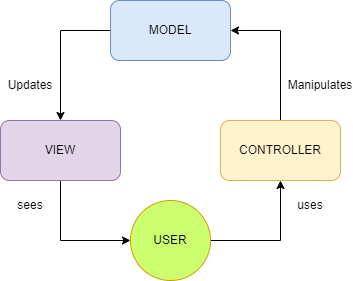

# Laporan Modul 1: Perkenalan Laravel
**Mata Kuliah:** Workshop Web Lanjut  
**Nama:** Putri Balqis  
**NIM:** 2024573010081  
**Kelas:** TI 2B

---

## Abstrak 
Pemilihan framework yang tepat sangat berpengaruh dalam pengembangan website agar sesuai kebutuhan dan efisien. Laravel sebagai salah satu framework PHP populer menawarkan fitur relevan yang membantu menekan biaya serta mempercepat waktu pengerjaan. Laporan ini disusun untuk memberikan pemahaman umum mengenai Laravel serta perannya dalam mendukung pembuatan aplikasi web modern secara efektif dan efisien.

---

## 1. Pendahuluan

- **Pengenalan Laravel**  
Laravel adalah sebuah framework berbasis bahasa pemograman PHP untuk mempermudah dan memaksimalkan proses pengembangan website. Dengan Laravel, website yang dihasilkan dapat menjadi lebih dinbamis, terstruktur, dan efisien. Kehadiran framework ini juga membuat PHP semakin kuat karena selalu menghadirkan fitur-fitur terbaru yang mendukung kebutuhan pngembangan aplikasi web modern.

- **Karakteristik Utama  Laravel**  
 Laravel adalah fraework yang berbasis opionated dengan arsitektur MVC, sehingga kode lebih rapi dan terstruktur. fitur utamanya meliputi routing sederhana, ORM Eloquet untuk akses database,Blade template engine, serta artisan CLI yang memepermudah otomatisasi. Dengan migration, middlewarw, dan keamanan bawaan, laravel mendorong penggunaan best practice sehingga pengembangan aplikasi web menjadi lebih cepat namun tetap standar. Laravel juga disebut sebagai opinionated framework, artinya Laravel sudah membawa seperangkat konvensi dan best practices yang menjadi panduan dalam membangun aplikasi.

- **Jenis aplikasi yang cocok dibuat menggunakan laravel**  
Laravel cocok digunakan untuk mengembangkann berbagai jenis aplikasi kecil seperti blog probadi, portofolio, dan situs web bisnis sederhana, hingga aplikasi skala besar seperti platfom e-commerce, aplikasi perusahaan, sistem manajemen waktu, maupun layanan bisnis Sasa. Dengan fitur lengkap arsitektur yang terstruktur, Laravel mampu mendukung kebutuhan pengembangan web dengan cepat, aman, dan mudah dipelihara.

---

## 2. Komponen Utama Laravel 
- **Blade Templating Engine**  
Laravel menggunakan blade sebagai mesin templatingnya, yang memungkinkan  untuk membuat tampilan HTML yang dinamis dengan mudah.

- **Eloquent ORM**  
Eloquent adalaah sistem ORM(Object-Relational-Mapping) yang terintegrasi dengan Laravel. fitur ini memungkinkan programer untuk berinteraksi dengan basis data menggunakan objek dan model.

- **Routing**  
Laravel memiliki sistem routing yang kuat untuk memudahkan dalam mendefinisikan URL. Melalui fitur ini, permintaan HTTP dapat diarahkan ke controller atau tindakan yang sesuai, sehingga logika rute terpisah dengan jelas dari proses yang dijalankan.

- **Controllers**  
Controller merupakan komponen fundamental dari pola arsitektur Model-View-Controller (MVC) yang bertindak sebagai perantara permintaan masuk dari klien dan logika bsinis aplikasi, yang sering di simpan dalam model, dan lapisan presentasi yang diwakili oleh tampilan.

-  **Migrations & Seeders**  
Migrations dalam Laravel digunakan untuk mengelola struktur basis data melalui kodde, seperti membuat atau mengubah tabel dan kolom. Seeders berfungsi untuk mengisi basis data dengan data awal maupun otomatis. Kedua fitus ini memudahkan kolaborasi, menjaga konsistensi skema, serta mempercepat pproses pengemvangan aplikasi.

- **Artisan CLI**  
Artisan adalah alat baris perintah bawaan Laravel yang memudahkan berbagai pekerjaan. Melalui Artisan, pengguna dapat membuat model, controller, serta migrasi basis data, menjalankan pengujian, hingga mengotomatisasi tugas-tugas rutin secara efisien.

- **Testing (PHPUnit)**  
PHPUnit berfungsi untuk memfasilitasi pengujian unit otomatis terhadap setiap bagian terkecil dari kode PHP seperti fungsi atau class, yang berguna untuk memastikan fungsionalitasnya sesuai ekspetasi.

- **Caching**  
Laravel memiliki sistem caching yang efisien untuk meningkatkan kinerja aplikasi. Hal ini memungkinkan menyimpan hasil query basis data atau hasil perhitungan ke dalam cache untuk menghindari pemrosesan berulang yang mahal secara komnputasi.

- **Validation**  
Laravel menyediakan sistem validasi yang kuat unntuk memvalidasi data yang masuk. Aturan validasi untuk setiap input form dapat dilakukan dengan mudah.

---

## 3. Berikan penjelasan untuk setiap folder dan files yang ada didalam struktur sebuah project laravel.
- **Folder app**  
folder ini merupakan tempat penyimpanan logika utama aplikasi Laravel. Pada folder ini berisi:  
  
  **HTTP/Controller**, folder berisi kelas pengontrol yang menangani perminttaan HTTP dan mengoordinasikan tanggapan. Dan didalamnya terdapat file Controller.php yaitu file dasar untuk semua controller    
  **Models**, folder ini menyimpan kelas model yang mewakili entity data dalam aplikasi. Didalamnya terdapat Model bawaan untuk tabel users yaitu User.php.  
  **Providers**, folder yang berisi service Provider yaitu kelas-kelas yang bertugas untuk mengatur layanan, binding, event, dan konfigurasi ketika laravel dijalankan.  
  
- **Folder Bootstrap**  
Folder ini berfungsi untuk menyiapkan dan menjalankan Laravel sebelum aplikasi dijalankan. Didalamnya juga terdapat file penting dan folder cache.  
  
  **cache**, berfungsi untuk menyimpan hasil cache agar peforma lebih cepat.  
  **app.php**, berfungsi sebagai starter utama aplikasi Laravel, dengan membuat instance Laravel.  
  **providers.php**, Berisi daftar service provider hasil cache untuk mempercepat load.  
  
- **Folder config**, Folder config menyimpan file konfigurasi untuk berbagai pengaturan aplikasi, seperti database, pencatatan kesalahan, dan rute. File-file ini digunakan untuk menyesuaikan perilaku aplikasi tanpa mengubah kode sumber. 
    
- **Folder Database**  
Folder database berisi file migrasi dan seeder untuk mengelola skema database.  
  
  **Factories**, Digunakan untuk membuat *model factory*, yaitu template untuk menghasilkan data dummy.  

  **Migrations/**, Menyimpan file migrasi yang berfungsi untuk membangun dan mengubah struktur tabel di database. 

  **seeders/**, Berisi file *seeder* untuk mengisi data awal ke database.  

  **.gitignore**, File untuk mengabaikan file/folder tertentu agar tidak ikut tersimpan di dalam version control (Git).  

- **Folder Resources**, Berisi folder resources menampung aset statis aplikasi Anda, seperti file CSS, JavaScript, dan tampilan Blade.  
- **Folder Routes**, Berisi folder storage digunakan untuk menyimpan file yang diunggah, file cache, dan file sesi.  
-  **Folder Tests**, Folder tests disediakan untuk menulis pengujian unit dan fitur untuk aplikasi.  
- **Folder Vendor**, Folder vendor berisi dependensi perpustakaan dan paket pihak ketiga yang digunakan oleh aplikasi. Perpustakaan ini dimuat menggunakan Composer, pengelola dependensi PHP.  
- **File .env**, File .env menyimpan variabel lingkungan yang digunakan oleh aplikasi Anda. Variabel ini dapat digunakan untuk mengonfigurasi database, cache, dan pengaturan lainnya.  
- **File composer.json**, File composer.json mendefinisikan dependensi paket dan versi yang diperlukan untuk aplikasi Anda. Digunakan oleh Composer untuk menginstal dan memperbarui dependensi.

---  
  
  
## 4. Diagram MVC dan Cara Kerjanya  
  

MVC memiliki cara kerja yang terpisah dan terstruktur, yaitu dengan memanfaatkan Model, View dan Controller. Masing-masing alur tersebut memiliki tugas, Dimulai dari Model yang berfungsi menentukan alur logika dari program yang akan dibuat dan dikembangkan. Model memastikan program dapat bertukar data dengan database melalui aksi CRUD, kemudian menampilkan hasilnya dalam View.  
View berperan sebagai output yang menggambarkan detail atau hasil dari permintaan yang dibuat oleh pengguna. Controller memastikan bahwa permintaan pengguna yang ingin ditampilkan pada View dapat diteruskan ke Model. Selanjutnya, respon dari Model dikembalikan ke Controller dan diteruskan ke View sesuai dengan peran yang telah dirancang.
  
---
 
## 5. Kelebihan & Kekurangan (refleksi singkat)
**Kelebihan Dari Laravel**  
- Struktur dan dokumentasinya sangat mudah dipelajari untuk pemula.
- Membuat proses developing menjadi lebih cepat dan efisien.
- Laravel sudah digunakan di seluruh dunia, sehingga pemula lebih mudah beradaptasi dengan project baru.
- Tools yang tersedia cocok untuk pemula maupun developer tingkat lanjut.
- Banyak sumber belajar, diskusi, dan solusi ketika menghadapi error.
- Membuat aplikasi lebih terorganisir dan mudah dipelihara.  

**Kekurangan Laravel** 
- Laravel perlu update versi secara rutin dan cepat, sehingga developer harus terus mengikuti perubahan.
- Dalam beberapa kasus, performa Laravel lebih lambat dibandingkan framework lain seperti CodeIgniter.
- Struktur dan fitur Laravel membuat ukuran kode lebih besar sehingga membutuhkan sumber daya lebih banyak. 

**Hal yang mungkin menjadi tantangan bagi pemula**  
Bagi  yang baru memulai, belajar Laravel tentu memiliki beberapa hambatan. Pertama, penting untuk memahami dasar-dasar PHP, seperti variabel, fungsi, tipe data, dan struktur kontrol, karena itu menjadi landasan utama sebelum masuk lebih jauh. Setelah itu, pemula juga harus mengenal arsitektur MVC (Model-View-Controller) yang memisahkan bagian logika, tampilan, dan data agar kode lebih terorganisir. Tantangan berikutnya adalah penggunaan Eloquent ORM, yaitu fitur Laravel untuk mengelola database dengan pendekatan berbasis objek. Selain itu, Blade sebagai templating engine juga perlu dipelajari agar bisa digunakan secara efektif dalam membangun tampilan. Terakhir, Composer yang berfungsi sebagai dependency manager sering kali menjadi kesulitan tersendiri bagi pemula yang baru pertama kali berhadapan dengan manajemen paket di PHP.

---
  
##  6. Referensi

- Apa Itu Laravel? Pengertian, Fitur dan Kelebihannya - https://www.dewaweb.com/blog/apa-itu-laravel/

- Laravel: Definisi, Fitur, Manfaat, Cara Kerja, Keunggulan dan Kekurangan — https://bit.telkomuniversity.ac.id/laravel-definisi-fitur-manfaat-cara-kerja-keunggulan-dan-kekurangan/

- Web Applications Create with Laravel -  https://www.sufalamtech.com/blog/web-applications-create-with-laravel#:~:text=dibuat%20dengan%20Laravel.-,1.,yang%20sangat%20baik%20untuk%20data

- 12 Fitur Laravel Framework PHP untuk Membangun Website - https://www.gamelab.id/news/2706-12-fitur-laravel-framework-php-untuk-membangun-website

- Penjelasan Struktur Folder Laravel untuk Pemula 2025 - https://blog.nawatara.com/penjelasan-struktur-folder-laravel-untuk-pemula-2025/

- Memahami Struktur Dasar Proyek Laravel: Penjelasan Setiap Folder dan File - https://himsiubsitegal.my.id/artikel/memahami-struktur-dasar-proyek-laravel-penjelasan-setiap-folder-dan-file

- MVC Adalah: Konsep, Cara Kerja, dan Contohnya - https://www.rumahweb.com/journal/mvc-adalah/

- Apa Itu Laravel Hingga Kelebihan dan Kekurangannya - https://www.gramedia.com/literasi/laravel/

- 7 Kesalahan Laravel Dev Pemula (dan Cara Menghindarinya) - https://medium.com/@careergunawan/7-kesalahan-laravel-dev-pemula-dan-cara-menghindarinya-8611ba079add

---